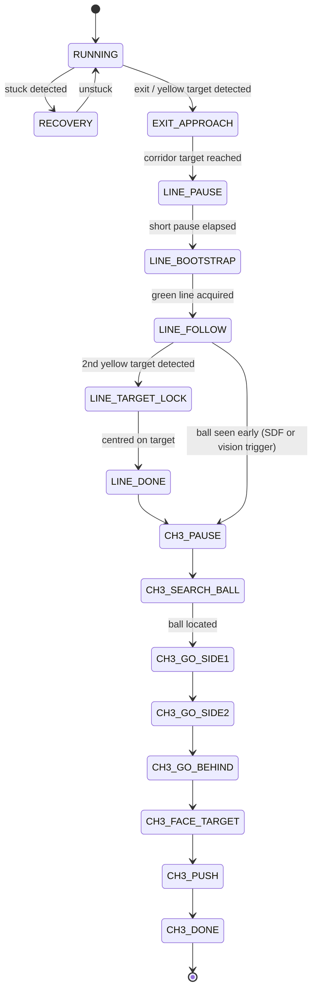
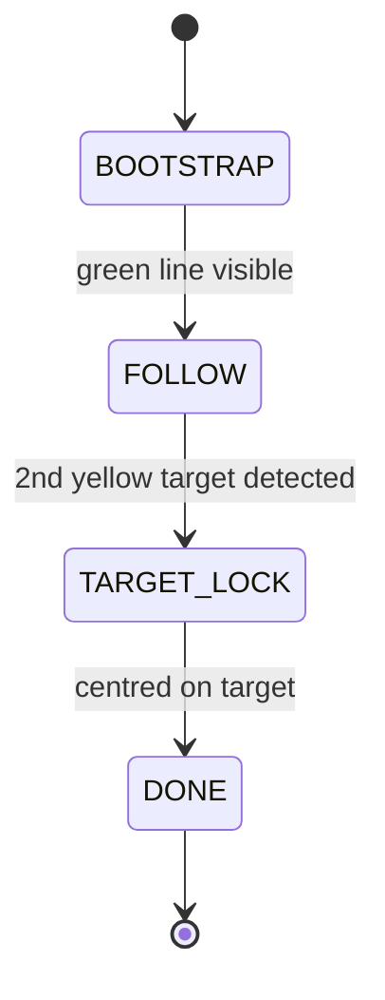
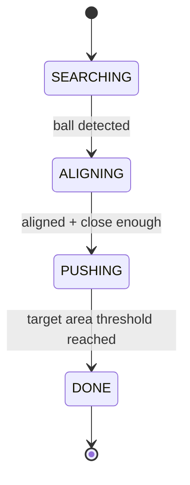

# TurtleBot3 ROS 2 Navigation Challenges


Three progressively harder autonomous navigation challenges for a **TurtleBot3 Burger** in Gazebo, unified into a **single continuous run** by one controller node that owns `/cmd_vel` throughout — no handoff race conditions between separate processes.

**The full pipeline runs end-to-end successfully**: corridor exit → line following → target lock → ball search → alignment → push, all in one uninterrupted mission, using only LiDAR and a single onboard camera.

<p align="center">
  <a href="https://youtube.com/shorts/1dUWR7mg9io?feature=share">
    
  </a>
  <br>
  <em>▶️ <a href="https://youtube.com/shorts/1dUWR7mg9io?feature=share">Watch Challenge 3 on YouTube</a> — the robot locates a randomly-placed ball and pushes it to the target.</em>
</p>

## The three challenges

| # | Challenge | Sensing | Core technique |
|---|---|---|---|
| 1 | **Corridor navigation** | 2D LiDAR | Reactive gap-centering + side-wall repulsion, continuous steering (no discrete 90° turn state) |
| 2 | **Line following** | Camera (HSV) | Green-line centroid tracking, target-ring detection to stop precisely on the second marker |
| 3 | **Ball pushing** | Camera + LiDAR + odometry | Visual search, waypoint-based approach around the ball, push to a target position |

## Why a single unified controller (`main_node`)

The project started with three independent nodes (`corridor_node`, `line_follow_node`, `ball_push_node`), each also runnable standalone via its own launch file. Running two of them simultaneously to hand off control caused **race conditions on `/cmd_vel`**: both nodes could publish velocity commands during the handoff window, producing jerky or contradictory motion.

`main_node.py` solves this by **inheriting the corridor controller directly** (`class MainController(CorridorNavigator)`) and internally switching its own state machine from corridor logic to line-following logic to ball-pushing logic — all inside one ROS node, one publisher, zero cross-node handoff.



**Note on the early-trigger path**: Challenge 3 doesn't have to wait for Challenge 2 to fully complete. If the ball is detected mid-line-following (either visually or, when enabled, by reading the ball's exact pose from the Gazebo SDF model — a pragmatic simulation shortcut used alongside the vision-based approach), the controller jumps straight into the ball-pushing phase once the robot is close enough. `params.yaml` exposes both paths (`ch2_ball_trigger_enabled` for vision-only, `ch2_sdf_ball_trigger_enabled` for the pose-based trigger) so either strategy can be toggled independently.

## Challenge 1 — corridor navigation in detail

The corridor is an S-shaped maze. An early design used a discrete "TURNING" state for 90° corners, but this got confused on the maze's continuous bends — a curve isn't a single discrete turn. The final design instead:

- **continuously steers toward the most open direction** ahead, using the LiDAR scan directly (gap-centering) rather than pre-classifying the corridor shape;
- applies **side-wall repulsion** so the robot doesn't hug either wall;
- falls back to **single-wall following** when only one wall is in range;
- includes an **anti-stuck recovery** state: if the robot hasn't moved more than `stuck_dist` in `stuck_time` seconds, it reverses and turns to break out, then resumes centering;
- switches to **camera-based final approach** near the exit: aligns on the yellow target color, detects the target ring in a narrow bottom-center region of interest, then continues by **odometry** for a calibrated camera-to-base offset distance so the robot's body (not just the camera) ends up centered on the target.

## Challenge 2 — line following in detail



After Challenge 1 ends, the robot is stopped inside the first target and the green line may not yet be visible in the camera's region of interest. A short **bootstrap** phase drives straight until the line is acquired, avoiding a premature "line lost" failure. The `FOLLOW` phase then tracks the green line's centroid in HSV space with a proportional angular controller, and switches to `TARGET_LOCK` once the second yellow target ring is confirmed over several consecutive frames (avoiding false triggers from a single noisy detection).

## Challenge 3 — ball pushing in detail



The standalone `ball_push_node` implements a simpler 4-state version (search / align / push / done) using only camera HSV detection and area-based distance proxies. The version integrated into `main_node` (and `full_run_node`) is more elaborate: it plans a **waypoint path around the ball** (`GO_SIDE1` → `GO_SIDE2` → `GO_BEHIND` → `FACE_TARGET`) so the robot approaches from behind the ball relative to the target, rather than pushing from an arbitrary direction — this matters because pushing from the wrong side sends the ball away from, not toward, the target.

## Repository layout

```
projet/
├── corridor_node.py      Challenge 1 — standalone reactive corridor navigator
├── line_follow_node.py   Challenge 2 — standalone green-line follower
├── ball_push_node.py     Challenge 3 — standalone ball pusher (simple 4-state version)
├── main_node.py          Challenges 1+2+3 combined in one continuous controller (recommended)
└── full_run_node.py      Alternative single-file combined controller (all 3 challenges, self-contained)

launch/
├── challenge1.launch.py  Standalone Challenge 1
├── challenge2.launch.py  Standalone Challenge 2
├── challenge3.launch.py  Standalone Challenge 3
├── main.launch.py        Full run via main_node (recommended entry point)
└── full_challenge.launch.py  Full run via full_run_node (alternative controller)

config/params.yaml        All tunable parameters for every node, namespaced by node/challenge
```

## Skills demonstrated

- **ROS 2 architecture**: multi-node vs. single-node design trade-offs, parameter files, launch-file composition with `IncludeLaunchDescription`, QoS profile tuning for sensor topics
- **Reactive control**: proportional gap-centering and wall-repulsion from raw LiDAR scans, without a pre-built map or planner
- **Classical computer vision**: HSV color segmentation, region-of-interest cropping, centroid/area-based target confirmation with temporal debouncing (multi-frame confirmation to reject noise)
- **State-machine design**: cascading state machines per challenge, and a single inherited state machine spanning all three to avoid actuator-command conflicts
- **Sensor fusion for navigation**: combining camera detections, LiDAR ranges, and odometry-based dead-reckoning for the final centering offset that vision alone can't resolve (camera-to-base geometric offset)
- **Systematic parameter tuning**: `params.yaml` centralizes ~150 tunable gains/thresholds across every phase, keeping magic numbers out of the code

## ⚠ External dependency: `challenge_project`

This package depends on an external ROS 2 package named `challenge_project` (declared in `package.xml`), which provides the Gazebo world, the TurtleBot3 Burger spawn logic, and the ball model (`model2.sdf`) referenced by the SDF-pose shortcut in Challenge 3. That package is course-provided infrastructure (ENSAM) and is **not included** in this repository — only the navigation logic developed for the challenges is included here.

## How to run

```bash
# Inside a ROS 2 workspace with challenge_project already built
colcon build --packages-select projet
source install/setup.bash

# Recommended: full run, all 3 challenges in one continuous mission
ros2 launch projet main.launch.py

# Or standalone, one challenge at a time
ros2 launch projet challenge1.launch.py
ros2 launch projet challenge2.launch.py
ros2 launch projet challenge3.launch.py

# Alternative combined controller (single self-contained node)
ros2 launch projet full_challenge.launch.py
```

## Background

Completed as part of the **Mechatronics engineering** program at Arts et Métiers (ENSAM), by Dev Kumar and David Tovmassian.

## License

Apache License 2.0 — see [LICENSE](LICENSE) (matching the license declared in `package.xml`).
